# 🏆 Fortnite Ranked Overlay for OBS

A free, live Fortnite ranked overlay and ELO tracker for streamers. Pulls real-time **ELO**, **rank**, and **season stats** from [OliTracker](https://olitracker.com) and displays them as an OBS browser source, so your Fortnite stream overlay always shows your current rank without you touching a thing.

✨ **8 designs** to choose from, any accent color you want, each one self-contained in its own folder, just grab the one you like.

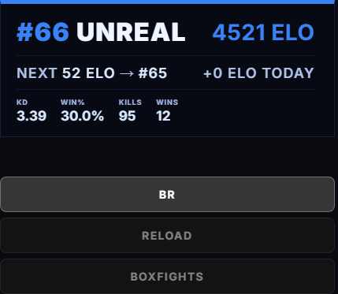

---

## 📋 Table of contents

- [Quick start](#-quick-start)
- [Setup wizard (the easy way)](#-setup-wizard-the-easy-way)
- [Features](#-features)
- [Designs](#-designs)
- [Requirements](#-requirements)
- [Setup](#-setup)
- [Switching game modes](#-switching-game-modes)
- [Switching between stats and creator code](#-switching-between-stats-and-creator-code)
- [Troubleshooting](#-troubleshooting)
- [Changing the accent color](#-changing-the-accent-color)
- [FAQ](#-faq)
- [How it works](#-how-it-works)
- [License](#-license)

---

## 🚀 Quick start

1. Click **Code > Download ZIP** above, unzip it, and open the folder for the design you want (see the gallery below). Or just run `setup.bat` and it'll ask which design you want and copy it straight to your Desktop.
2. Run `account-id.bat` to look up your Epic Account ID.
3. Open `server.py`, paste your username and account ID into the two lines near the top, save.
4. Run `start.bat`. Add a Browser Source in OBS pointed at `http://localhost:8888/overlay`.

That's it, you're live. Full details for each step are below if you get stuck anywhere. 👇

---

## 🧙 Setup wizard (the easy way)

Don't want to edit any files by hand? Download **`FortniteOverlaySetup.exe`** from the [latest release](https://github.com/fwsoapy/ranked-overlay/releases/latest) instead of the manual steps above.

It walks you through everything in a console window: picks a design from a small preview window, lets you set an accent color (by name or hex code), asks whether you want stats or a creator code shown, looks up your Epic Account ID for you automatically, then builds a ready-to-run overlay folder right next to the `.exe` and offers to start it and open it in your browser, all in one go. No editing `server.py`, no separate Account ID lookup step.

> 💡 The wizard is just a convenience layer over the same 8 designs in this repo, it builds the exact same `server.py`/`start.bat`/`stop.bat` files described below. Use whichever way you prefer.

---

## ✨ Features

- **Live rank, ELO, and leaderboard position**, pulled every 10 seconds
- **Session ELO delta**: tracks how much you've gained or lost since you started the overlay
- **Unreal leaderboard tracking**: shows ELO to next rank (`NEXT 14 ELO to #66`)
- **Non-Unreal progress tracking**: shows promotion progress % and percent gained today (`53% TO GOLD III`)
- **Mode switcher** for BR, Reload, and Boxfights, each with its own independent stats, and your last selected mode is remembered the next time the overlay loads
- **Live stats / creator code toggle**, right in the browser, no restart needed, see [below](#-switching-between-stats-and-creator-code)
- **Season stats** (K/D, Win%, Kills, Wins), accurate per game mode
- **8 overlay designs**, any accent color you want
- **Built-in error messages**: if something goes wrong (bad account ID, OliTracker is down, etc.) a small message shows under the card instead of the overlay just sitting there blank

---

## 🎨 Designs

Click a design's name to open its folder. Every design can show either **season stats** or a **creator code**, switchable live with the on-overlay toggle, so each one gets two previews below.

<table>
<tr>
<th>Design</th>
<th>Stats mode</th>
<th>Creator code mode</th>
</tr>
<tr>
<td width="20%"><a href="Minimal"><b>Minimal</b></a><br>Clean single-row card with rank and ELO side-by-side and a bold colored left border.</td>
<td align="center" width="40%">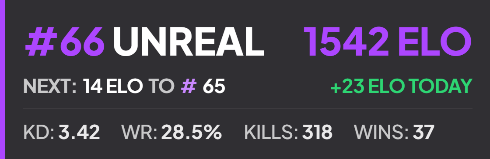</td>
<td align="center" width="40%">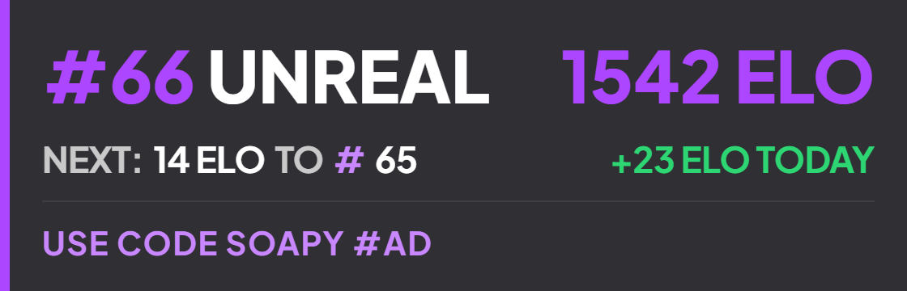</td>
</tr>
<tr>
<td width="20%"><a href="Classic"><b>Classic</b></a><br>A timeless dark card with a thin top accent line and subtle dividers between sections.</td>
<td align="center" width="40%">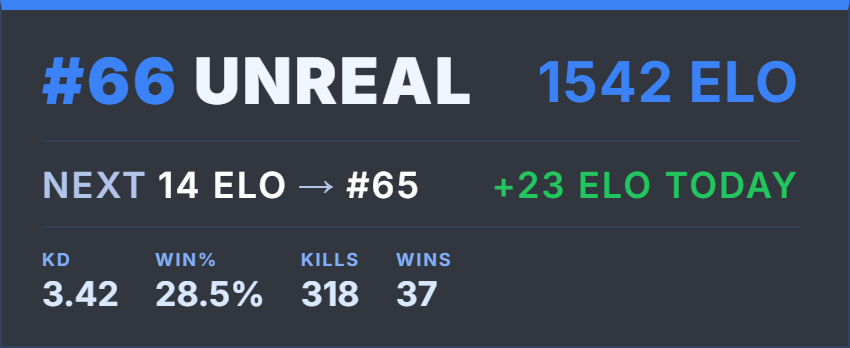</td>
<td align="center" width="40%">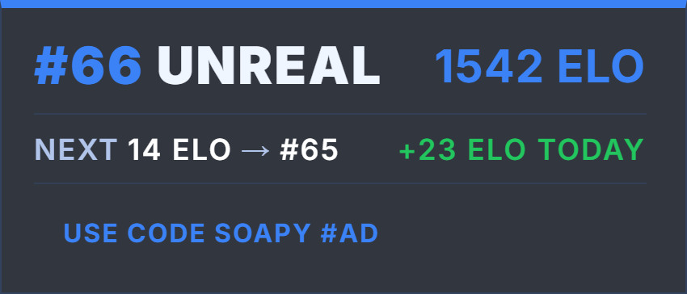</td>
</tr>
<tr>
<td width="20%"><a href="Sharp"><b>Sharp</b></a><br>Stacked sections with a strong accent color and clipped corners. Feels structured and aggressive.</td>
<td align="center" width="40%">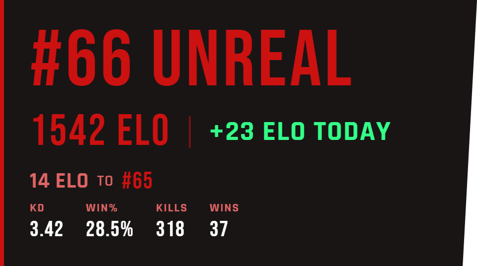</td>
<td align="center" width="40%">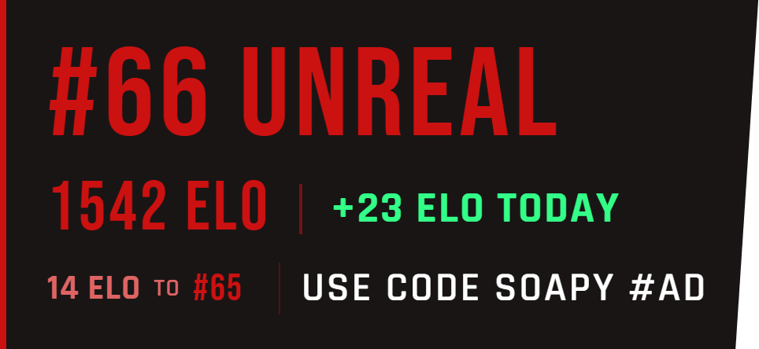</td>
</tr>
<tr>
<td width="20%"><a href="Wide"><b>Wide</b></a><br>Spread out horizontally with a glowing accent bar on the left. Great for wider stream layouts.</td>
<td align="center" width="40%">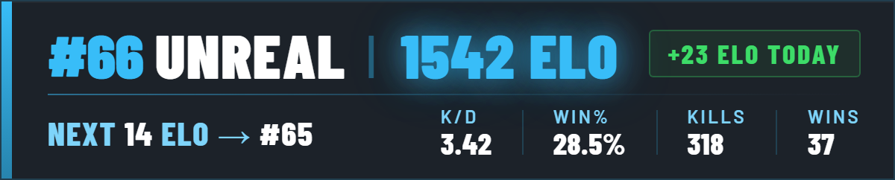</td>
<td align="center" width="40%">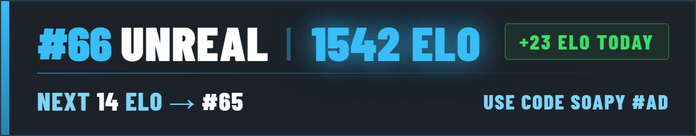</td>
</tr>
<tr>
<td width="20%"><a href="Slash"><b>Slash</b></a><br>A diagonal cut splits the rank and ELO into two panels. Stands out on any stream.</td>
<td align="center" width="40%">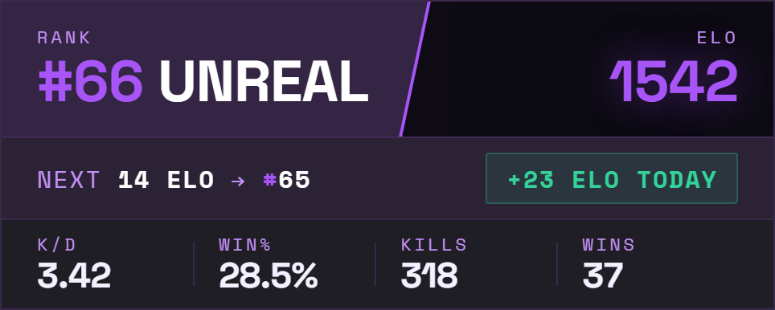</td>
<td align="center" width="40%">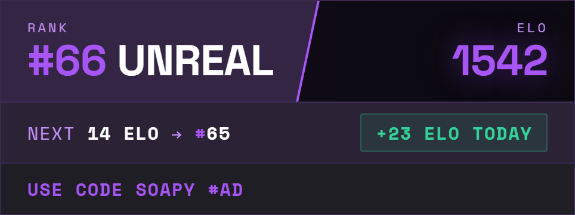</td>
</tr>
<tr>
<td width="20%"><a href="Rainbow"><b>Rainbow</b></a><br>Animated rainbow rank text and a shimmering ELO value. High energy.</td>
<td align="center" width="40%">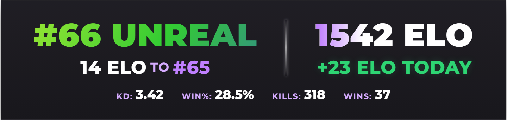</td>
<td align="center" width="40%">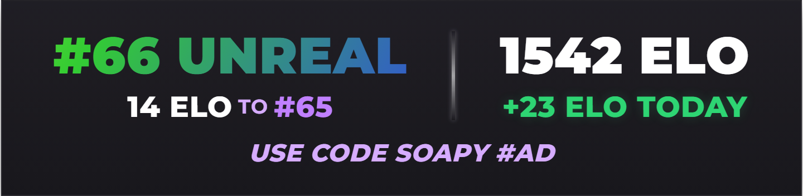</td>
</tr>
<tr>
<td width="20%"><a href="Modern"><b>Modern</b></a><br>Sleek card with a soft radial glow accent and a bold colored left border.</td>
<td align="center" width="40%">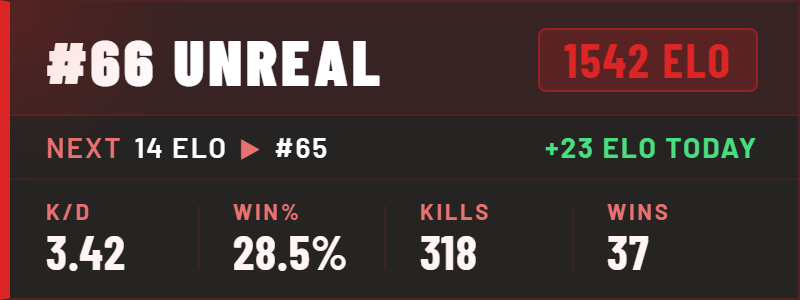</td>
<td align="center" width="40%">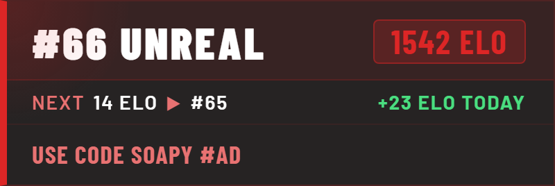</td>
</tr>
<tr>
<td width="20%"><a href="Pulse"><b>Pulse</b></a><br>Green terminal HUD with a radial progress gauge and monospace readout. Built for a clean, tactical look.</td>
<td align="center" width="40%">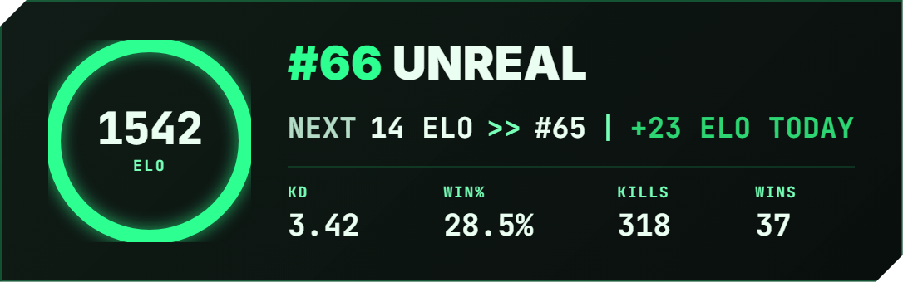</td>
<td align="center" width="40%">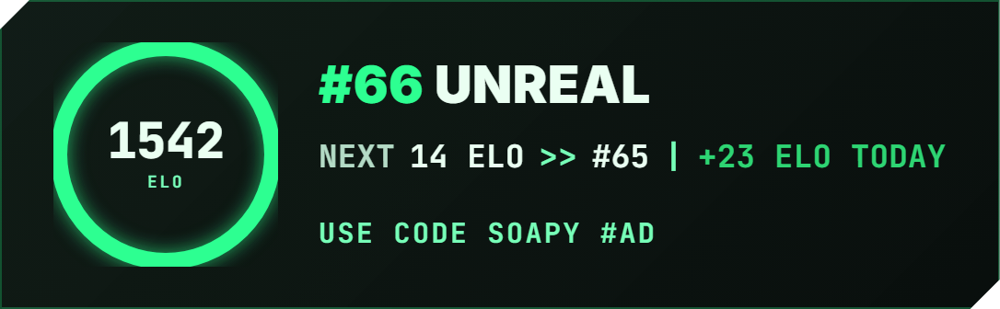</td>
</tr>
</table>

---

## ✅ Requirements

- **Python 3 or later.** Download it from [python.org/downloads](https://www.python.org/downloads/) if you don't have it. During setup, tick **Add python.exe to PATH**, the overlay won't start without it.
- **Windows.** The `.bat` files are Windows only. Mac/Linux users can run `python server.py` directly from a terminal, and look up their Account ID manually at [olitracker.com](https://olitracker.com) instead of using `account-id.bat`.
- **OBS Studio** with a Browser Source.
- **Your Epic Account ID** (the bundled `account-id.bat` looks this up for you, see Setup below).

---

## 🛠️ Setup

> 💡 Every design folder (`Minimal/`, `Classic/`, `Sharp/`, `Wide/`, `Slash/`, `Rainbow/`, `Modern/`, `Pulse/`) is **self-contained**: it has its own `server.py`, `account-id.bat`, `start.bat`, and `stop.bat`. You only ever need the one folder for the design you picked.

### 1️⃣ Download the files

Click **Code > Download ZIP** at the top of this page, then unzip it anywhere on your PC. Your Desktop works fine. The ZIP includes all 8 designs, so open the folder for the one you picked from the gallery above, everything you need is in there.

If you'd rather not dig through folders, run `setup.bat` in the unzipped repo. It asks which design you want and copies just that one to your Desktop in a clean folder by itself.

> ⚠️ Windows may show a SmartScreen warning ("Windows protected your PC") the first time you run any of the `.bat` files, since they were downloaded from the internet. Click **More info > Run anyway**. This is normal for any downloaded script, the files only run Python and a console window, nothing else.

### 2️⃣ Find your Epic Account ID

Double-click `account-id.bat`. Enter your Epic display name and it will print your account ID in the console window and copy it to your clipboard.

If it can't find your account, search your username at [olitracker.com](https://olitracker.com) instead, open your profile, and copy the account ID out of the page URL.

### 3️⃣ Add your account ID to the server file

Open `server.py` in Notepad (right-click > Open with > Notepad) and find these two lines near the top:

```python
EPIC_USERNAME    = "YourUsername"
EPIC_ACCOUNT_ID  = "your-account-id-here"
```

Replace both values with your username and account ID, then save the file.

### 4️⃣ Start the overlay

Double-click `start.bat`. A window will briefly appear confirming it started, then close itself. The overlay is now running in the background.

- On some setups (depends on how Python was installed) a second window titled **"Fortnite Overlay Server"** stays open instead of closing. That's normal, just leave it open and minimize it, closing it stops the overlay.
- To stop the overlay, double-click `stop.bat`.
- Want to run **more than one design at once** to compare them side by side? Each one defaults to port `8888`, so only one can run at a time on that port. Open `server.py` in the second design's folder and change `PORT = 8888` to something else like `8889`, then use that port in its OBS Browser Source URL.

### 5️⃣ Add it to OBS

1. In OBS, click the **+** button under Sources
2. Select **Browser**
3. Set the URL to `http://localhost:8888/overlay`
4. Set Width to `600` and Height to `300` (adjust to taste)
5. Click OK

🎉 The overlay will appear and start showing your live stats within a few seconds of your first game.

---

## 🎮 Switching game modes

The overlay shows mode buttons (**BR**, **Reload**, **Boxfights**) below the widget. Click a button to switch, and the rank, ELO, and stats all update for that mode. Your choice is remembered the next time you open the overlay. In OBS you can interact with browser sources by right-clicking the source and selecting **Interact**.

> ℹ️ You'll only see buttons for modes you actually have ranked stats in. If you've never queued Reload, no Reload button shows up, that's expected, not a bug.

---

## 🔁 Switching between stats and creator code

Below the mode buttons there are two more buttons, **Stats** and **Creator Code**. Click between them to switch what shows on the card, live, with no server restart needed. Pick **Creator Code** and a text box appears where you can type your own code directly in the browser, it updates the overlay instantly as you type.

Both your chosen mode and whatever code you typed are remembered the next time the overlay loads, the same way the BR/Reload/Boxfights choice is remembered. The `CREATOR_CODE` value in `server.py` is just the starting default, the on-page toggle is the source of truth once you've used it.

---

## 🩹 Troubleshooting

**Overlay shows "starting up" for a long time**
OliTracker may be slow to respond. Wait 30 seconds, and if it still doesn't load, check that your Account ID in `server.py` is correct.

**A small orange message shows up under the overlay**
That's the actual error from the server. For example, `HTTP 404 from OliTracker` usually means the account ID is wrong, and `no ranked data found` usually means the account has no ranked games played yet. Fix what it says and it clears on the next poll.

**Port already in use error**
Something else is using port 8888. Run `stop.bat` first, then start it again. If the issue persists, change `PORT = 8888` to another number like `8889` in `server.py` and update the OBS URL to match.

**Stats look wrong after switching modes**
Give it one poll cycle (about 10 seconds) after clicking a mode button. The server fetches fresh data on each cycle.

**OBS shows a black box instead of the overlay**
Make sure `start.bat` has been run first, the browser source needs the local server running. Also double check the URL in OBS is exactly `http://localhost:8888/overlay`.

**Windows says the file is unsafe / SmartScreen popup**
That's expected for any `.bat` file downloaded from the internet. Click **More info > Run anyway**.

**I want to see exactly what the server is doing**
While the overlay is running, open `http://localhost:8888/debug` in a browser for a full status dump (current rank, ELO, detected modes, last error), or `http://localhost:8888/raw` for the raw OliTracker response. Both are handy if something looks wrong and the on-overlay error message isn't enough to go on.

---

## 🌈 Changing the accent color

Two ways to do this:

**🔍 Quick preview, no editing**
Add `?color=` followed by a hex code to the overlay URL, both in your regular browser and in the OBS Browser Source. For example: `http://localhost:8888/overlay?color=ff7a00`. This overrides the accent color at runtime, useful for trying out a color before committing to it. *(On the Rainbow design, the rank text always stays an animated rainbow, the override only changes the highlight colors around it.)*

**💾 Permanent change**
Open `server.py` and find the CSS inside `OVERLAY_HTML`. The main accent color is defined as a hex value like `#7c3aed` (purple) or `#dc2626` (red), near the top of the `<style>` block as a `--accent` variable. Change that one line and the whole design updates. Use [coolors.co](https://coolors.co) to pick one.

---

## ❓ FAQ

**Does this work on Mac or Linux?**
Yes! Run `python server.py` from a terminal instead of `start.bat`, and look up your Account ID manually at [olitracker.com](https://olitracker.com) instead of running `account-id.bat`. Everything else is the same.

**Can I run two designs at the same time to compare them?**
Yes, see the port note under Setup above. Change the port in one of them so they don't collide.

**Does this slow down Fortnite or use a lot of resources?**
Nope. It's a tiny local web server that polls OliTracker every 10 seconds. CPU and memory use are both negligible.

**Can I resize or reposition the overlay?**
Yes, it's a normal OBS Browser Source. Resize, move, and add filters to it exactly like any other source.

**Will this break if Epic or OliTracker changes something?**
It depends on OliTracker's API staying in the same shape. If stats suddenly stop updating, check `/debug` first (see Troubleshooting), and check that [olitracker.com](https://olitracker.com) itself is loading your stats correctly in a normal browser.

**Is any of my data sent anywhere besides OliTracker?**
No. The server only talks to the OliTracker API to pull your stats, and serves the overlay page to your own browser/OBS on your own PC. Nothing else.

---

## ⚙️ How it works

This Fortnite rank tracker is a small Python web server that runs locally on your PC. It polls the OliTracker API every 10 seconds, parses your ranked stats, and serves a single HTML page at `localhost:8888/overlay`. OBS loads that page as a browser source and auto-refreshes the displayed data, turning it into a live Fortnite stream overlay with zero manual updates. No data ever leaves your machine other than the API request to OliTracker.

---

## 📄 License

MIT, see [LICENSE](LICENSE). Use it, edit it, ship it, just don't blame us if Fortnite changes their API.

---

## 💬 Credits

Built by **fwsoapy** on Discord. Stats powered by [OliTracker](https://olitracker.com).
