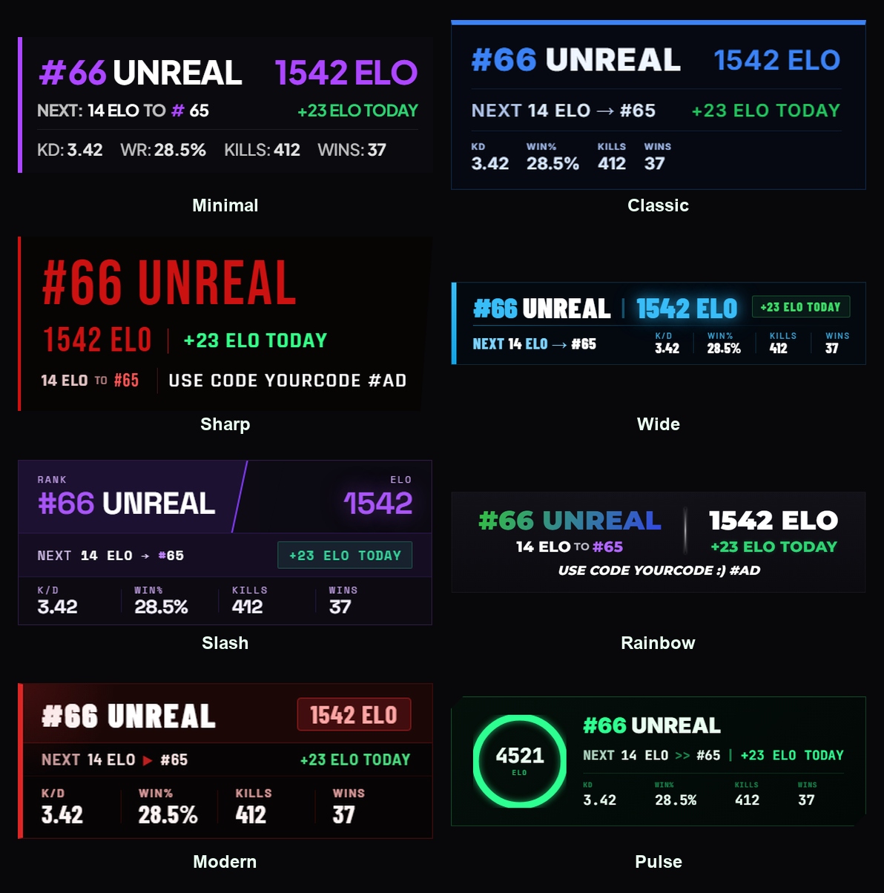
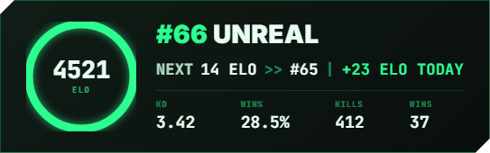

# Fortnite Ranked Overlay

A live ranked overlay for Fortnite streamers. Pulls real-time ELO, rank, and season stats from [OliTracker](https://olitracker.com) and displays them as a browser source in OBS. Supports multiple game modes, automatic non-Unreal progression tracking, and a built-in mode switcher for BR, Reload, and Boxfights.

8 designs to choose from, each in its own self-contained folder, just grab the one you like.


---

## Quick start

1. Click **Code > Download ZIP** above, unzip it, and open the folder for the design you want (see the gallery below). Or run `setup.bat` at the top level and it will ask which design you want and copy it straight to your Desktop.
2. Run `account-id.bat` to look up your Epic Account ID.
3. Open `server.py`, paste your username and account ID into the two lines near the top, save.
4. Run `start.bat`. Add a Browser Source in OBS pointed at `http://localhost:8888/overlay`.

Full details for each step are below.

---

## Features

- Live rank, ELO, and leaderboard position pulled every 10 seconds
- Session ELO delta: tracks how much you've gained or lost since you started the overlay
- Unreal leaderboard: shows ELO to next rank (`NEXT 14 ELO to #66`)
- Non-Unreal ranks: shows promotion progress % and percent gained today (`53% TO GOLD III`)
- Mode switcher buttons for BR, Reload, and Boxfights, each with their own independent stats, and your last selected mode is remembered the next time the overlay loads
- Season stats (K/D, Win%, Kills, Wins) accurate per game mode
- 8 overlay designs to choose from, any accent color you want
- If something goes wrong (bad account ID, OliTracker is down, etc.) a small error message shows under the card instead of the overlay just sitting there blank

---

## Designs



Click a preview below to open that design's folder.

<table>
<tr>
<td align="center" width="50%">
<a href="Minimal"><br><b>Minimal</b></a>
<br>Clean single-row card with rank and ELO side-by-side and a bold colored left border.
</td>
<td align="center" width="50%">
<a href="Classic"><br><b>Classic</b></a>
<br>A timeless dark card with a thin top accent line and subtle dividers between sections.
</td>
</tr>
<tr>
<td align="center" width="50%">
<a href="Sharp"><br><b>Sharp</b></a>
<br>Stacked sections with a strong accent color and clipped corners. Feels structured and aggressive.
</td>
<td align="center" width="50%">
<a href="Wide"><br><b>Wide</b></a>
<br>Spread out horizontally with a glowing accent bar on the left. Great for wider stream layouts.
</td>
</tr>
<tr>
<td align="center" width="50%">
<a href="Slash"><br><b>Slash</b></a>
<br>A diagonal cut splits the rank and ELO into two panels. Stands out on any stream.
</td>
<td align="center" width="50%">
<a href="Rainbow"><br><b>Rainbow</b></a>
<br>Animated rainbow rank text and a shimmering ELO value. High energy.
</td>
</tr>
<tr>
<td align="center" width="50%">
<a href="Modern"><br><b>Modern</b></a>
<br>Sleek card with a soft radial glow accent and a bold colored left border.
</td>
<td align="center" width="50%">
<a href="Pulse"><br><b>Pulse</b></a>
<br>Green terminal HUD with a radial progress gauge and monospace readout. Built for a clean, tactical look.
</td>
</tr>
</table>

---

## Requirements

- Python 3 or later
- Windows (the `.bat` files are Windows only; Mac/Linux users can run `python server.py` directly)
- OBS Studio with a Browser Source
- Your Epic Account ID (the bundled `account-id.bat` looks this up for you, see Setup below)

---

## Setup

Every design folder (`Minimal/`, `Classic/`, `Sharp/`, `Wide/`, `Slash/`, `Rainbow/`, `Modern/`, `Pulse/`) is self-contained: it has its own `server.py`, `account-id.bat`, `start.bat`, and `stop.bat`. You only ever need the one folder for the design you picked.

### 1. Download the files

Click **Code > Download ZIP** at the top of this page, then unzip it anywhere on your PC. Your Desktop works fine. The ZIP includes all 8 designs, open the folder for the one you picked from the gallery above, everything you need is in there.

If you'd rather not dig through folders, run `setup.bat` in the unzipped repo. It asks which design you want and copies just that one to your Desktop in a clean folder by itself.

Windows may show a SmartScreen warning ("Windows protected your PC") the first time you run any of the `.bat` files, since they were downloaded from the internet. Click **More info > Run anyway**. This is normal for any downloaded script, the files only run Python and a console window, nothing else.

### 2. Find your Epic Account ID

Double-click `account-id.bat`. Enter your Epic display name and it will print your account ID in the console window and copy it to your clipboard.

### 3. Add your account ID to the server file

Open `server.py` in Notepad (right-click > Open with > Notepad) and find these two lines near the top:

```python
EPIC_USERNAME    = "YourUsername"
EPIC_ACCOUNT_ID  = "your-account-id-here"
```

Replace both values with your username and account ID. Save the file.

### 4. Start the overlay

Double-click `start.bat`. A window will briefly appear confirming it started, then close itself. The overlay is now running in the background.

To stop it, double-click `stop.bat`.

### 5. Add it to OBS

1. In OBS, click the **+** button under Sources
2. Select **Browser**
3. Set the URL to `http://localhost:8888/overlay`
4. Set Width to `600` and Height to `300` (adjust to taste)
5. Click OK

The overlay will appear and start showing your live stats within a few seconds of your first game.

---

## Switching game modes

The overlay shows mode buttons (BR, Reload, Boxfights) below the widget. Click a button to switch and the rank, ELO, and stats all update for that mode. Your choice is remembered the next time you open the overlay. In OBS you can interact with browser sources by right-clicking the source and selecting **Interact**.

---

## Troubleshooting

**Overlay shows "starting up" for a long time**
OliTracker may be slow to respond. Wait 30 seconds, and if it still does not load, check that your Account ID in `server.py` is correct.

**A small orange message shows up under the overlay**
That's the actual error from the server, for example "HTTP 404 from OliTracker" usually means the account ID is wrong, "no ranked data found" usually means the account has no ranked games played yet. Fix what it says and it clears on the next poll.

**Port already in use error**
Something else is using port 8888. Run `stop.bat` first, then start it again. If the issue persists, change `PORT = 8888` to another number like `8889` in `server.py` and update the OBS URL to match.

**Stats look wrong after switching modes**
Give it one poll cycle (about 10 seconds) after clicking a mode button. The server fetches fresh data on each cycle.

**OBS shows a black box instead of the overlay**
Make sure `start.bat` has been run first. The browser source needs the local server to be running. Also check that the URL in OBS is exactly `http://localhost:8888/overlay`.

**Windows says the file is unsafe / SmartScreen popup**
That's expected for any `.bat` file downloaded from the internet. Click **More info > Run anyway**.

---

## Changing the accent color

Two ways to do this:

**Quick preview, no editing**
Add `?color=` followed by a hex code to the overlay URL, both in your regular browser and in the OBS Browser Source. For example: `http://localhost:8888/overlay?color=ff7a00`. This overrides the accent color at runtime, useful for trying out a color before committing to it. (On the Rainbow design, the rank text always stays an animated rainbow, the override only changes the highlight colors around it.)

**Permanent change**
Open `server.py` and find the CSS inside `OVERLAY_HTML`. The main accent color is defined as a hex value like `#7c3aed` (purple) or `#dc2626` (red), near the top of the `<style>` block as a `--accent` variable. Change that one line and the whole design updates. Use [coolors.co](https://coolors.co) to pick one.

---

## How it works

The overlay is a small Python web server that runs locally on your PC. It polls the OliTracker API every 10 seconds, parses your ranked stats, and serves a single HTML page at `localhost:8888/overlay`. OBS loads that page as a browser source and auto-refreshes the displayed data. No data ever leaves your machine other than the API request to OliTracker.

---

## License

MIT, see [LICENSE](LICENSE). Use it, edit it, ship it, just don't blame us if Fortnite changes their API.

---

## Credits

Built by fwsoapy on Discord. Stats powered by [OliTracker](https://olitracker.com).
