# 🏆 Fortnite Ranked Overlay for OBS

A free, live Fortnite ranked overlay and ELO tracker for streamers. Pulls real-time **ELO**, **rank**, and **season stats** from [OliTracker](https://olitracker.com) and displays them as an OBS browser source, so your Fortnite stream overlay always shows your current rank without you touching a thing.

✨ **8 designs** to choose from, any accent color you want, each one self-contained in its own folder, just grab the one you like.

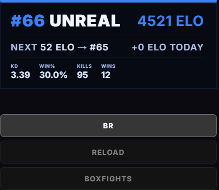

---

## 📺 Watch: full setup walkthrough

A start-to-finish video showing how to download, set up, and use the overlay:

<video src="https://github.com/fwsoapy/ranked-overlay/releases/download/v1/how-to-use.mp4" controls width="100%"></video>

> ▶️ Not playing here? [Click to watch or download the setup video](https://github.com/fwsoapy/ranked-overlay/releases/download/v1/how-to-use.mp4) (it's also attached to the [latest release](https://github.com/fwsoapy/ranked-overlay/releases/latest)).

---

## 🌐 No download: use the website

**👉 [Open Ranked Overlay](https://fwsoapy.github.io/ranked-overlay/)**

Type your Epic name, pick a design and a color, copy the link, and paste it into an OBS Browser Source (leave Height at the default `600`, then hold **Alt** and drag the bottom edge up to crop it to the card, so the buttons under it stay off stream). That's the whole setup. Nothing runs on your PC, so there's no Python, no `.bat` files, no antivirus or SmartScreen warnings, and nothing to update. It's always the newest version.

It's the same 8 designs and the same numbers as the download version below, with every option the download has (accent color, stats or creator code, starting mode, update speed, leaderboard lookups) plus a choice of what the ELO change counts: Session (the default), which shows as "+23 ELO TODAY" and starts over by itself once your ELO hasn't moved for 6 hours, so each stream opens on +0 (to start over sooner, right-click the source in OBS > **Interact** and press **Reset ELO gain** under the card), or the last 12 or 24 hours. The download version still works exactly as before if you prefer it.

---

## 📋 Table of contents

- [No download: use the website](#-no-download-use-the-website)
- [Watch: full setup walkthrough](#-watch-full-setup-walkthrough)
- [Quick start](#-quick-start)
- [Setup wizard (the easy way)](#-setup-wizard-the-easy-way)
- [Features](#-features)
- [Designs](#-designs)
- [Requirements](#-requirements)
- [Setup](#-setup)
- [Switching game modes](#-switching-game-modes)
- [Switching between stats and creator code](#-switching-between-stats-and-creator-code)
- [Auto updates](#-auto-updates)
- [Troubleshooting](#-troubleshooting)
- [Changing the accent color](#-changing-the-accent-color)
- [FAQ](#-faq)
- [How it works](#-how-it-works)
- [Working on the overlay](#-working-on-the-overlay)
- [License](#-license)

---

## 🚀 Quick start

> 🌐 **Don't want to download anything? [Use the website](https://fwsoapy.github.io/ranked-overlay/)**, it's one link to paste into OBS.
>
> 🧙 **The fastest way is the [setup wizard](#-setup-wizard-the-easy-way)** it does every step below for you (design, color, Account ID lookup, and launch). Prefer to set it up by hand? Here's the manual way:

1. Click **Code > Download ZIP** above, unzip it, and open the folder for the design you want (see the gallery below). Or run `setup.bat` and it'll ask which design you want and copy it to your Desktop.
2. Double-click `overlay.bat`. Pick **3** to look up your Epic Account ID, then **4** to paste it into your settings and save.
3. Pick **1** to start it. Add a Browser Source in OBS pointed at `http://localhost:8888/overlay`.

That's it, you're live. Full details for each step are below if you get stuck anywhere. 👇

---

## 🧙 Setup wizard (the easy way)

Don't want to edit any files by hand? Download **`FortniteOverlaySetup.zip`** from the [latest release](https://github.com/fwsoapy/ranked-overlay/releases/latest), unzip it, and run `FortniteOverlaySetup.exe` inside the extracted folder instead of the manual steps above.

It walks you through everything in a console window: pick a design from a preview window, set an accent color (by name or hex code), choose whether to show stats or a creator code, and it looks up your Epic Account ID for you. Then it builds a ready-to-run folder next to the `.exe` and offers to start it and open it in your browser. If an overlay is already running on port 8888 it stops that one first. Nothing to edit, nothing to look up separately.

> 💡 The wizard is just a shortcut. It builds the exact same three files described below. Use whichever way you prefer.

> ⚠️ It ships as a zip (rather than a single `.exe`) because standalone PyInstaller executables are commonly flagged as false positives by antivirus heuristics, distributing it as an extracted folder instead of a self-extracting single file avoids that. Windows SmartScreen may still warn the first time you run it since it's an unsigned indie tool, click **More info > Run anyway**, same as the `.bat` files.

---

## ✨ Features

- **Live rank, ELO, and leaderboard position**, pulled every 30 seconds
- **Session ELO delta**: tracks how much you've gained or lost since you started the overlay. Close it and reopen it and the count starts fresh
- **Unreal leaderboard tracking**: shows ELO to next rank (`NEXT 14 ELO to #66`)
- **Works down to placement #10,000**: OliTracker only publishes ELO for the top 10,000 of each mode's leaderboard, so the ELO row shows automatically once you're inside it and hides again if you drop out, no restart needed
- **Non-Unreal progress tracking**: shows promotion progress % and percent gained this session (`53% TO GOLD III`)
- **Mode switcher** for BR, Reload, and Boxfights, each with its own independent stats, and your last selected mode is remembered the next time the overlay loads
- **Live stats / creator code toggle**, right in the browser, no restart needed, see [below](#-switching-between-stats-and-creator-code)
- **Season stats** (K/D, Win%, Kills, Wins), accurate per game mode
- **Keeps itself current**: checks this repo for a newer version on startup and once a day after, and asks before installing it. Your account ID, creator code, accent color and port all carry across untouched. If an update ever fails to start, it puts the old one back on its own, see [below](#-auto-updates)
- **Survives new seasons**: season stats reset with the season, a ranked playlist added in a future season turns up as its own button with its own stats and ELO, and the ELO counter re-baselines on rollover instead of reading as a huge loss
- **8 overlay designs**, any accent color you want
- **Built-in error messages**: if something goes wrong (bad account ID, OliTracker is down, etc.) a small message shows under the card instead of the overlay just sitting there blank

---

## 🎨 Designs

Click a design's name to open its folder. Every design can show either **season stats** or a **creator code**, switchable live with the on-overlay toggle, so each one gets two previews below.

<table>
<tr>
<th>Design</th>
<th>Stats mode</th>
<th>Creator code mode</th>
</tr>
<tr>
<td width="20%"><a href="Minimal"><b>Minimal</b></a><br>Clean single-row card with rank and ELO side-by-side and a bold colored left border.</td>
<td align="center" width="40%">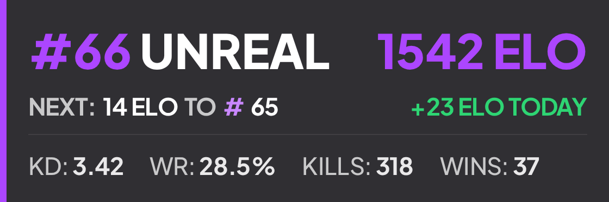</td>
<td align="center" width="40%">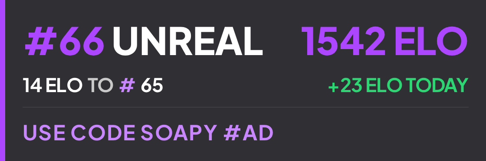</td>
</tr>
<tr>
<td width="20%"><a href="Classic"><b>Classic</b></a><br>A timeless dark card with a thin top accent line and subtle dividers between sections.</td>
<td align="center" width="40%">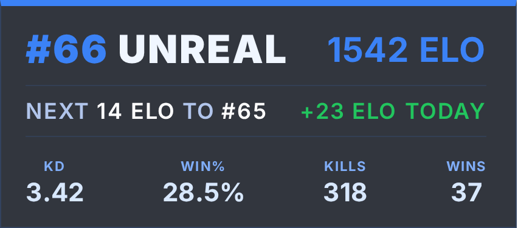</td>
<td align="center" width="40%">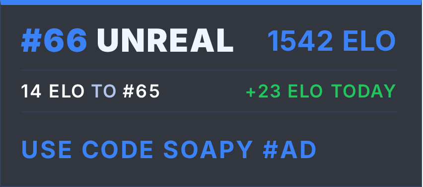</td>
</tr>
<tr>
<td width="20%"><a href="Sharp"><b>Sharp</b></a><br>Stacked sections with a strong accent color and clipped corners. Feels structured and aggressive.</td>
<td align="center" width="40%">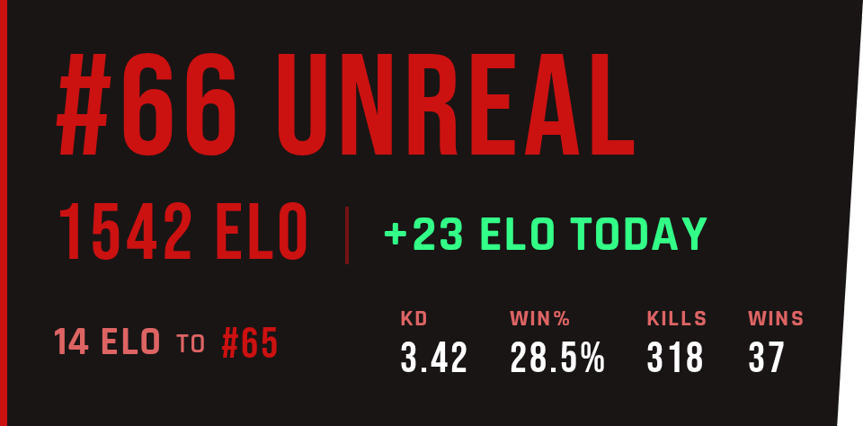</td>
<td align="center" width="40%">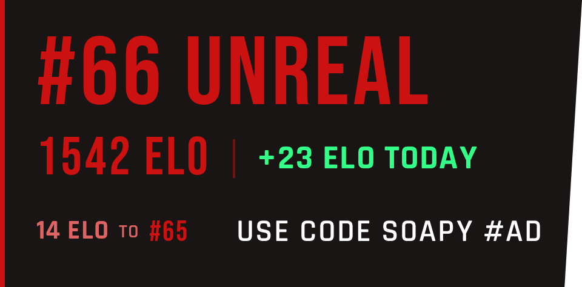</td>
</tr>
<tr>
<td width="20%"><a href="Wide"><b>Wide</b></a><br>Spread out horizontally with a glowing accent bar on the left. Great for wider stream layouts.</td>
<td align="center" width="40%">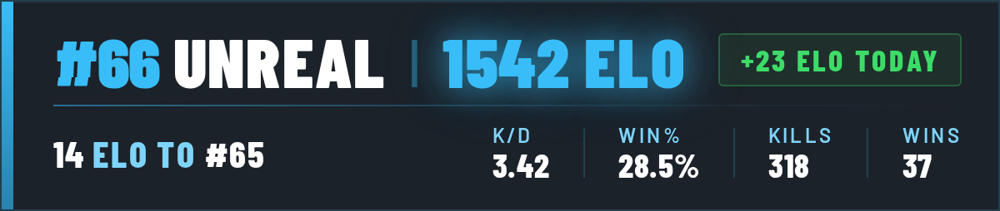</td>
<td align="center" width="40%">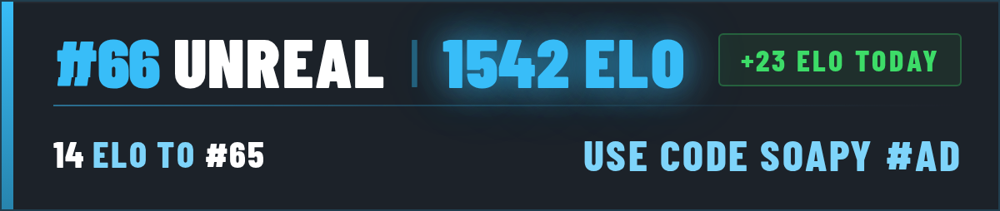</td>
</tr>
<tr>
<td width="20%"><a href="Slash"><b>Slash</b></a><br>A diagonal cut splits the rank and ELO into two panels. Stands out on any stream.</td>
<td align="center" width="40%">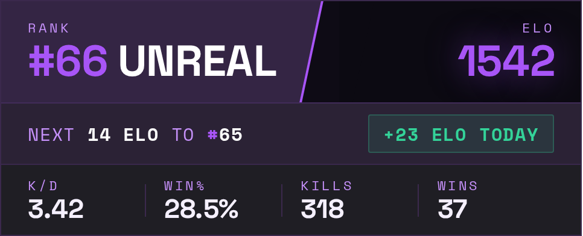</td>
<td align="center" width="40%">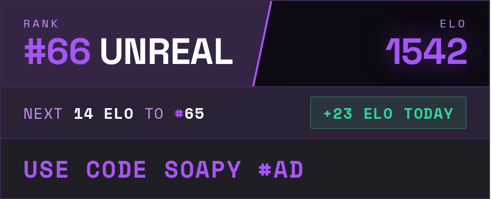</td>
</tr>
<tr>
<td width="20%"><a href="Rainbow"><b>Rainbow</b></a><br>Animated rainbow rank text and a shimmering ELO value. High energy.</td>
<td align="center" width="40%">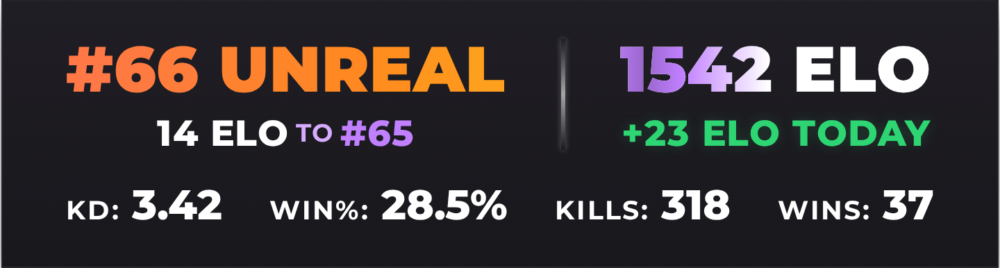</td>
<td align="center" width="40%">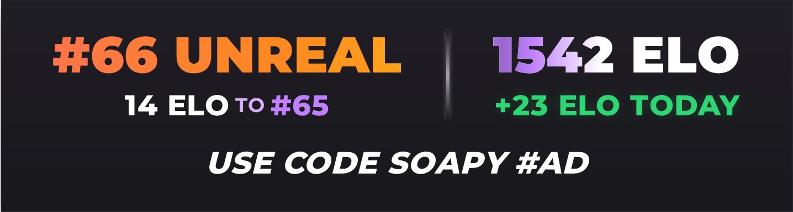</td>
</tr>
<tr>
<td width="20%"><a href="Modern"><b>Modern</b></a><br>Sleek card with a soft radial glow accent and a bold colored left border.</td>
<td align="center" width="40%">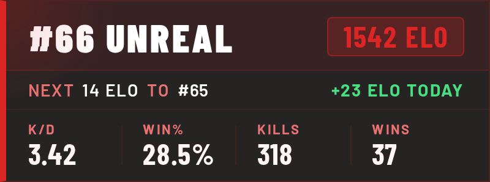</td>
<td align="center" width="40%">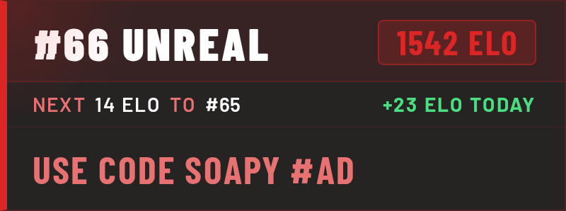</td>
</tr>
<tr>
<td width="20%"><a href="Pulse"><b>Pulse</b></a><br>Green terminal HUD with a radial progress gauge and monospace readout. Built for a clean, tactical look.</td>
<td align="center" width="40%">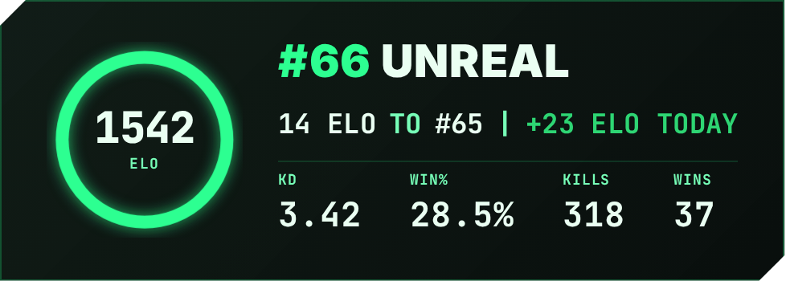</td>
<td align="center" width="40%">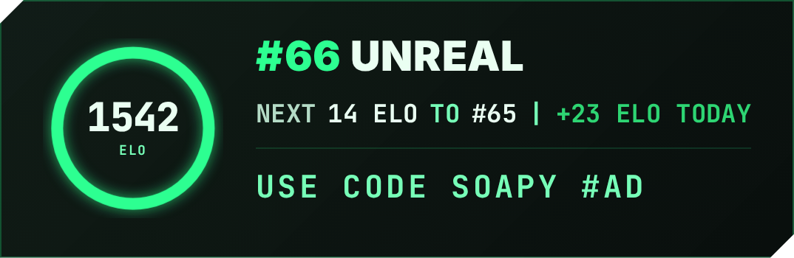</td>
</tr>
</table>

---

## ✅ Requirements

- **Python 3 or later.** Download it from [python.org/downloads](https://www.python.org/downloads/) if you don't have it. During setup, tick **Add python.exe to PATH**, the overlay won't start without it.
- **Windows.** `overlay.bat` is Windows only. On Mac/Linux run `python server.py` from a terminal and look your Account ID up at [olitracker.com](https://olitracker.com).
- **OBS Studio** with a Browser Source.
- **Your Epic Account ID** (`overlay.bat` looks this up for you, see Setup below).

---

## 🛠️ Setup

> 💡 Every design folder (`Minimal/`, `Classic/`, `Sharp/`, `Wide/`, `Slash/`, `Rainbow/`, `Modern/`, `Pulse/`) holds three files and nothing else:
>
> | | |
> |---|---|
> | `overlay.bat` | start, stop, look up your Account ID, edit your settings |
> | `config.json` | your settings, the only file you ever edit |
> | `server.py` | the overlay itself, replaced whole by updates |
>
> You only need the one folder for the design you picked. Don't edit `server.py` by hand, the next update overwrites it. `config.json` is never touched.

### 1️⃣ Download the files

Click **Code > Download ZIP** at the top of this page, then unzip it anywhere on your PC. Your Desktop works fine. The ZIP includes all 8 designs, so open the folder for the one you picked from the gallery above, everything you need is in there.

If you'd rather not dig through folders, run `setup.bat` in the unzipped repo. It asks which design you want and copies just that one to your Desktop in a clean folder by itself.

> ⚠️ Windows may show a SmartScreen warning ("Windows protected your PC") the first time you run any of the `.bat` files, since they were downloaded from the internet. Click **More info > Run anyway**. This is normal for any downloaded script, the files only run Python and a console window, nothing else.

### 2️⃣ Find your Epic Account ID

Double-click `overlay.bat` and pick **3**. Type your Epic display name and it prints your account ID and copies it to your clipboard.

If it can't find you, search your name at [olitracker.com](https://olitracker.com), open your profile, and grab the account ID out of the page URL.

### 3️⃣ Add your account ID

Back in `overlay.bat`, pick **4**. That opens `config.json` in Notepad:

```json
{
  "epic_username": "YourUsername",
  "epic_account_id": "your-account-id-here",
  "creator_code": "",
  "auto_update": "prompt",
  "port": 8888
}
```

Fill in the first two, save, close Notepad. Done.

> ℹ️ `config.json` is the only file you edit. Updates replace `server.py` completely and never open `config.json`, so an update can't wipe your account ID or your colour. Upgrading from an older version that kept settings inside `server.py`? Those get copied across for you the first time the new version runs.

### 4️⃣ Start the overlay

In `overlay.bat`, pick **1**. It starts in the background and opens a preview in your browser so you can see it's working. Close that tab whenever, the overlay keeps running.

- The menu shows whether it's running or stopped, so you can always check.
- To stop it, pick **2**.
- On some setups (depends how Python was installed) a window titled **"Fortnite Overlay Server"** stays open. That's normal, minimise it. Closing it stops the overlay.
- Want **two designs running at once** to compare them? They both default to port `8888`, so set `"port": 8889` in the second one's `config.json` and point its OBS source at that.

### 5️⃣ Add it to OBS

1. In OBS, click the **+** button under Sources
2. Select **Browser**
3. Set the URL to `http://localhost:8888/overlay`
4. Set Width to `600` and Height to `300` (adjust to taste)
5. Click OK

🎉 The overlay will appear and start showing your live stats within a few seconds of your first game.

---

## 🎮 Switching game modes

The overlay shows mode buttons (**BR**, **Reload**, **Boxfights**) below the widget. Click a button to switch, and the rank, ELO, and stats all update for that mode. Your choice is remembered the next time you open the overlay. In OBS you can interact with browser sources by right-clicking the source and selecting **Interact**.

> ℹ️ You'll only see buttons for modes you actually have ranked stats in. If you've never queued Reload, no Reload button shows up, that's expected, not a bug.

---

## 🔁 Switching between stats and creator code

Below the mode buttons there are two more buttons, **Stats** and **Creator Code**. Click between them to switch what shows on the card, live, with no server restart needed. Pick **Creator Code** and a text box appears where you can type your own code directly in the browser, it updates the overlay instantly as you type. Switching between the two never changes the size of the overlay, so nothing else in your OBS scene shifts around.

Your choice and the code you typed are remembered per design the next time the overlay loads, the same way the BR/Reload/Boxfights choice is remembered. The `creator_code` value in `config.json` (or whatever you picked in the wizard) sets the starting default: that's what shows the first time, and if you later change it there and restart, the new setting takes over again.

---

## 🔄 Auto updates

Fortnite seasons come and go and OliTracker changes shape with them, so the overlay keeps itself current instead of slowly drifting out of date.

On startup, and once a day after that, it reads [`update.json`](update.json) in this repo. If there's a newer build, you get a pop-up:

> **Update available**
> Fortnite Ranked Overlay 2.3.0 is available. You are on 2.2.0.
> Your settings, colour and account ID all carry over.
> **[ Update now ]  [ Not now ]**

Say yes and it downloads that version of your design, restarts itself, and carries on. Say no and it won't ask again for that particular version.

Occasionally a release will be one that older versions genuinely can't work without, usually because OliTracker changed something. Those are marked in `update.json`, and instead you'll get:

> **Update required**
> Fortnite Ranked Overlay 3.0.0 is out, and your version (2.2.0) no longer works.
> **[ Update now ]  [ Close overlay ]**

If you close it there, the overlay still starts, but the OBS source shows an "update required" notice instead of your rank, so you find out on the desktop rather than mid-stream.

**What carries over:** everything. Your account ID, creator code, accent colour, port and mode preference all live in `config.json`, which updates never open. The version it replaced is kept in `%LOCALAPPDATA%\FortniteRankOverlay` in case you want it back.

**If an update goes wrong:** the overlay waits to see the new version actually start serving. If it doesn't, the old one is put back automatically and that version is never offered again. You don't have to do anything.

**What it does and doesn't do:** it only ever reads from this repo over HTTPS, and nothing about you is uploaded anywhere. A download that is unreachable, incomplete, or doesn't parse as a working overlay is thrown away. If GitHub is unreachable it just carries on quietly, it will never block you from streaming because it couldn't check.

To change how it behaves, set `auto_update` in `config.json`:

```json
{ "auto_update": "prompt" }
```

| Setting | What happens |
|---|---|
| `"prompt"` | Asks first, installs if you say yes. **Default.** |
| `"silent"` | Installs newer versions without asking. |
| `"off"` | Never checks, never updates. |

You can check what you're running at any time at `http://localhost:8888/version`.

> ℹ️ Coming from a version before 2.0? You'll need to download once by hand. Those builds have no updater in them to do it for you.

---

## 🩹 Troubleshooting

**Overlay shows "starting up" for a long time**
OliTracker may be slow to respond. Wait 30 seconds, and if it still doesn't load, check that your `epic_account_id` in `config.json` is correct.

**A small orange message shows up under the overlay**
That's the actual error from the server. For example, `HTTP 404 from OliTracker` usually means the account ID is wrong, and `no ranked data found` usually means the account has no ranked games played yet. Fix what it says and it clears on the next poll.

**Port already in use error**
Something else is using port 8888. Pick **2** in `overlay.bat` to stop it, then **1** to start again. If it keeps happening, set `"port": 8889` in `config.json` and use that port in OBS. `overlay.bat` reads the port from `config.json`, so it follows along on its own.

**Stats look wrong after switching modes**
Give it one poll cycle (about 30 seconds) after clicking a mode button. The server fetches fresh data on each cycle.

**OBS shows a black box instead of the overlay**
Make sure the overlay is actually running, the browser source needs it. Open `overlay.bat` and check the status line at the top. Also double check the URL in OBS is exactly `http://localhost:8888/overlay`.

**Windows says the file is unsafe / SmartScreen popup**
That's expected for any `.bat` file downloaded from the internet. Click **More info > Run anyway**.

**I want to see exactly what the server is doing**
While the overlay is running, open `http://localhost:8888/debug` in a browser for a full status dump (current rank, ELO, detected modes, last error), or `http://localhost:8888/raw` for the raw OliTracker response. Both are handy if something looks wrong and the on-overlay error message isn't enough to go on.

---

## 🌈 Changing the accent color

Two ways to do this:

**🔍 Quick preview, no editing**
Add `?color=` followed by a hex code to the overlay URL, both in your regular browser and in the OBS Browser Source. For example: `http://localhost:8888/overlay?color=ff7a00`. This overrides the accent color at runtime, useful for trying out a color before committing to it. *(On the Rainbow design, the rank text always stays an animated rainbow, the override only changes the highlight colors around it.)*

**💾 Permanent change**
Add an `accent` to `config.json` and restart the overlay:

```json
{ "accent": "ff7a00" }
```

Six hex digits, no `#`. That's applied on top of whatever the design ships with, so it survives updates. Use [coolors.co](https://coolors.co) to pick one. *(Tip: the `?color=` trick above is easier still and needs no editing at all.)*

---

## ❓ FAQ

**Does this work on Mac or Linux?**
Yes. Run `python server.py` from a terminal and look your Account ID up at [olitracker.com](https://olitracker.com). Everything else is the same.

**Can I run two designs at the same time to compare them?**
Yes, see the port note under Setup above. Change the port in one of them so they don't collide.

**Does this slow down Fortnite or use a lot of resources?**
Nope. It's a tiny local web server that polls OliTracker every 30 seconds. CPU and memory use are both negligible.

**Can I resize or reposition the overlay?**
Yes, it's a normal OBS Browser Source. Resize, move, and add filters to it exactly like any other source.

**Will this break if Epic or OliTracker changes something?**
It depends on OliTracker's API staying in the same shape. If stats suddenly stop updating, check `/debug` first (see Troubleshooting), and check that [olitracker.com](https://olitracker.com) itself is loading your stats correctly in a normal browser.

**Is any of my data sent anywhere besides OliTracker?**
No. The server only talks to the OliTracker API to pull your stats, and serves the overlay page to your own browser/OBS on your own PC. Nothing else.

---

## ⚙️ How it works

This Fortnite rank tracker is a small Python web server that runs locally on your PC. It polls the OliTracker API every 30 seconds, parses your ranked stats, and serves a single HTML page at `localhost:8888/overlay`. OBS loads that page as a browser source and auto-refreshes the displayed data, turning it into a live Fortnite stream overlay with zero manual updates. No data ever leaves your machine other than the API request to OliTracker.

The [website version](https://fwsoapy.github.io/ranked-overlay/) does the same thing inside the page itself: the overlay's JavaScript reads OliTracker through a small Cloudflare Worker (OliTracker doesn't allow web pages to read it directly) and works out exactly what the Python server would. OliTracker refreshes a profile about every 3 minutes, so the website asks right after each refresh and never more often than that. It also stops asking while the overlay isn't on screen and slows down when OBS is open but you're not live.

---

## 🔧 Working on the overlay

Only needed if you're changing the code. If you just want to use the overlay, you can stop reading here.

### The repo layout

All 8 designs share the same server. `src/` is the only place anything is written by hand:

```
src/core_head.py      the server, everything above the overlay markup
src/designs/*.html    one file per design, just the markup
src/core_tail.py      the server, everything below it
src/launcher/*.bat    start / stop / account-id, one copy each
src/web/engine.js     the website's version of the server, in JavaScript
src/web/index.html    the website's setup page
```

Everything in `Minimal/`, `Classic/`, ... and `wizard/templates/` is **generated** from those, and so is the website in `docs/` (GitHub Pages serves that folder). The website uses the very same `src/designs/*.html`, so a design change shows up in both. After changing anything in `src/`:

```bash
python tools/build.py
```

CI runs `python tools/build.py --check` on every push, so a generated file edited by hand fails the build rather than silently getting overwritten at the next release.

### The website

`src/web/engine.js` is a line-by-line port of the Python logic, so the two must agree. CI runs the real Python server and the JavaScript engine on the same OliTracker responses and compares every field they hand the designs, and checks the website stays within its request budget:

```bash
python tests/web/test_engine.py     # needs Node.js
```

If you change how `src/core_head.py` works out a number, make the same change in `src/web/engine.js`.

The Cloudflare Worker the website talks to is `web/worker.js`; `web/README.md` covers deploying it. To try the site locally, run `python -m http.server` inside `docs/` and open `http://localhost:8000`.

### Cutting a release

```bash
python tools/release.py 2.3.0 --notes "Fixes ELO after the season reset"
```

That stamps the version into `src/`, rebuilds all 16 design folders, and rewrites [`update.json`](update.json). Then commit and push **the tag along with the commit**:

```bash
git add -A && git commit -m "v2.3.0: fixes ELO after the season reset"
git tag v2.3.0
git push origin main --tags
```

Installed overlays download from the tag named in `update.json`, not from `main`, so `update.json` must never land on `main` before the tag it points at exists. Everyone gets the update prompt within a day, or immediately if they restart.

### Making an old version stop working

`min_supported` in `update.json` is the lever. Anything below it gets a prompt that can't be postponed.

```bash
python tools/release.py 3.0.0 --min-supported 3.0.0 --notes "OliTracker changed its API"
```

Use it sparingly. It locks people out mid-stream, so it's only for when an old build genuinely can't show correct data any more. An ordinary release should leave it alone.

### Safety rails already in place

- A manifest that can't be read, or that's malformed, is ignored entirely. A GitHub outage or a typo in `update.json` can never take everyone's overlay down.
- A `min_supported` newer than `latest` is ignored, since it would block everyone with nothing to update to.
- Downloads are parsed and sanity-checked before anything is written.
- After installing, the old process waits to see the new one actually serve. If it doesn't, the backup is restored and that version is added to a local blocklist so it's never offered again.
- `config.json` is never read or written by the update path.

---

## 📄 License

MIT, see [LICENSE](LICENSE). Use it, edit it, ship it, just don't blame us if Fortnite changes their API.

---

## 💬 Credits

Built by **fwsoapy** on Discord. Stats powered by [OliTracker](https://olitracker.com).
