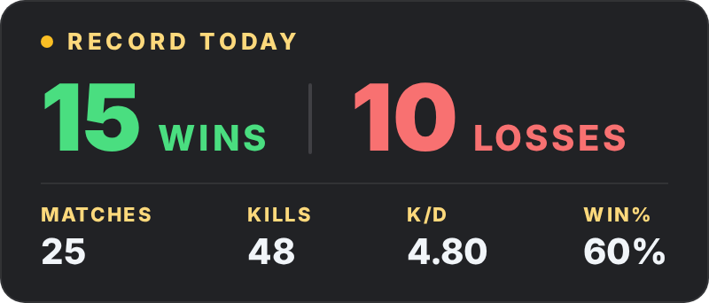
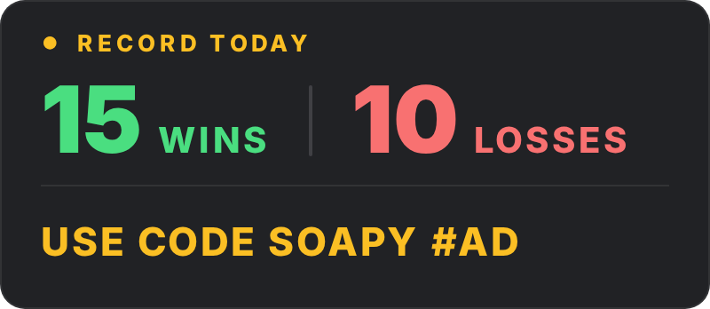

# Fortnite Ranked Overlay for OBS

A free, live Fortnite ranked overlay for streamers. It shows your **rank**, **ELO**, how much you've gained today, your **wins and losses**, and your season stats, and it updates on its own while you play. Stats come from [OliTracker](https://olitracker.com).

It runs as a website. There's nothing to download, install or run on your PC, so no antivirus warnings and nothing to keep updated.

### 👉 [Open Ranked Overlay](https://fwsoapy.github.io/ranked-overlay/)


---

## Contents

- [Set it up](#set-it-up)
- [Designs](#designs)
- [Options](#options)
- [Using it in OBS](#using-it-in-obs)
- [Wins and losses](#wins-and-losses)
- [Troubleshooting](#troubleshooting)
- [FAQ](#faq)
- [How it works](#how-it-works)
- [Working on the code](#working-on-the-code)

---

## Set it up

1. Open the [website](https://fwsoapy.github.io/ranked-overlay/) and type your Epic name. It finds your account ID for you. You can also paste an account ID or an OliTracker link.
2. Pick a design and an accent color. The preview shows demo numbers until you add your account, then your real ones.
3. Click **Copy OBS link**.
4. In OBS, add a **Browser** source, paste the link into **URL**, keep the size at the default **800 x 600**, and click OK.
5. Hold **Alt** and drag the bottom edge of the source up until it sits just under the card. That crops the mode buttons out of your stream.

That's it. The overlay keeps itself up to date. If you change something later, copy the link again and paste it over the old one.

---

## Designs

There are 9 designs. Every one can show season stats, a creator code or nothing at all below the rank (a smaller card), and any accent color works on all of them. On Rainbow, a picked color replaces the rainbow with shades of that color.

<table>
<tr>
<th>Design</th>
<th>Stats</th>
<th>Creator code</th>
</tr>
<tr>
<td width="20%"><b>Minimal</b><br>Clean single-row card with rank and ELO side by side and a bold colored left border.</td>
<td align="center" width="40%"></td>
<td align="center" width="40%"></td>
</tr>
<tr>
<td width="20%"><b>Classic</b><br>A dark card with a thin top accent line and subtle dividers between sections.</td>
<td align="center" width="40%"></td>
<td align="center" width="40%"></td>
</tr>
<tr>
<td width="20%"><b>Sharp</b><br>Big stacked text and clipped corners. Structured and aggressive.</td>
<td align="center" width="40%"></td>
<td align="center" width="40%"></td>
</tr>
<tr>
<td width="20%"><b>Wide</b><br>Spread out sideways with a glowing bar on the left. Good for wide layouts.</td>
<td align="center" width="40%"></td>
<td align="center" width="40%"></td>
</tr>
<tr>
<td width="20%"><b>Slash</b><br>A diagonal cut splits rank and ELO into two panels.</td>
<td align="center" width="40%"></td>
<td align="center" width="40%"></td>
</tr>
<tr>
<td width="20%"><b>Rainbow</b><br>Animated rainbow rank text and a shimmering ELO value. High energy.</td>
<td align="center" width="40%"></td>
<td align="center" width="40%"></td>
</tr>
<tr>
<td width="20%"><b>Modern</b><br>A sleek card with a soft glow and a bold colored left border.</td>
<td align="center" width="40%"></td>
<td align="center" width="40%"></td>
</tr>
<tr>
<td width="20%"><b>Pulse</b><br>Green terminal HUD with a radial gauge and a monospace readout.</td>
<td align="center" width="40%"></td>
<td align="center" width="40%"></td>
</tr>
<tr>
<td width="20%"><b>Record</b><br>Just your record: wins in green, losses in red, with matches, kills and K/D, or your win % and top placements, under it. See <a href="#wins-and-losses">Wins and losses</a>.</td>
<td align="center" width="40%"></td>
<td align="center" width="40%"></td>
</tr>
</table>

---

## Options

Everything is on the setup page, and the link it gives you remembers all of it.

| Option | What it does |
| --- | --- |
| **Account** | Your Epic name, account ID or OliTracker link. |
| **Design** | One of the 9 above. |
| **Accent color** | A swatch or any custom color. The header, labels and creator code all follow it. |
| **Below your rank** | Season stats (K/D, win %, kills, wins) or your creator code. You can flip between them live in OBS. |
| **Wins and losses** | Adds a "3 WINS, 1 LOSS" footer at the bottom of the card of any design. See below. |
| **Mode** | Auto, BR, Reload or Boxfights, the mode the overlay starts on. Modes your account hasn't played are greyed out. |
| **ELO change** | What "+23 ELO TODAY" counts. **Session** (the default) counts from when you press **Reset ELO gain** in OBS, and starts over by itself after 3 hours with no ELO change, so each stream opens on +0. Or pick **Last 12h** or **Last 24h**. |
| **Update speed** | Auto checks right after OliTracker refreshes your profile (about every 3 minutes). You can slow it to every 5 or 10 minutes. |
| **Leaderboard** | Shows your ELO and the gap to the next spot ("14 ELO TO #65"). Turn it off to hide ELO when OliTracker doesn't include it. |
| **Background** | Only changes the setup page preview (transparent, gameplay or green screen). Your stream sees a transparent overlay. |
| **Edit a link you made before** | Paste an old link under *More options* to load all its settings back. |

Below Unreal there's no ELO, so the overlay shows your promotion progress instead, like "53% TO DIAMOND III", and how much of it you gained today.

---

## Using it in OBS

Right-click the Browser source and pick **Interact**. The buttons under the card only show there, because the crop hides them from your viewers:

- the mode buttons (BR, Reload, Boxfights)
- **Stats** and **Creator Code**, to switch what's under your rank, and a box to type a different code
- **Reset ELO gain**, to start the Session count over (it only shows when ELO change is set to Session)

Can't see all the buttons? Raise the **Height** in the source's properties. The crop keeps them hidden from viewers either way.

Your last choices are remembered, so the overlay comes back the way you left it.

---

## Wins and losses

You can show your record two ways:

- tick **Wins and losses** on the setup page to add a footer like "3 WINS, 1 LOSS" to the bottom of any design, or
- pick the **Record** design to make the record the whole overlay.

It counts the same stretch as your ELO change (Session, Last 12h or Last 24h).

The count comes from your season totals on OliTracker. Every extra match played is a game, and a game that didn't add a win is a loss. OliTracker updates those totals **a few minutes after each game**, so a win or loss won't show up the second a match ends. The overlay picks it up as soon as OliTracker publishes it.

Boxfights has no season totals on OliTracker, so its record comes from the match list instead.

---

## Troubleshooting

**The preview shows the same numbers every time**
That's the demo, which shows until you add an account.

**A small orange message appears under the overlay**
It's the actual problem, and it clears on its own once it's fixed.
- *HTTP 404 from OliTracker*: the account ID is wrong. Check it on the setup page.
- *no ranked data found*: the account hasn't played ranked yet.
- *no ranked Boxfights games yet, showing BR*: the link asks for a mode the account hasn't played, so it shows another one.
- *request failed: couldn't reach the proxy*: a network hiccup. It retries by itself.
- *proxy is busy, trying again shortly*: the shared service hit its daily limit or a busy moment. It retries shortly.

**It says "no Epic account ID in the link"**
The link was made without an account. Add yours on the setup page and copy the link again.

**My win or loss isn't showing**
OliTracker takes a few minutes to update. See [Wins and losses](#wins-and-losses).

**It looks frozen while I'm not streaming**
To save requests, it only checks every 10 minutes while OBS is open but not streaming, recording or running the virtual camera, and not at all while the source is hidden. It catches up when you go live or show the source.

**The colors look wrong in my browser**
Browser night modes and dark-mode extensions (Brave's night mode, Dark Reader) can recolor the preview. They don't affect what OBS shows.

**Everything is blank in OBS**
Check the URL in the source is the full link from the setup page, then right-click the source and pick **Refresh cache of current page**.

---

## FAQ

**Do I need to download anything?**
No. Everything runs in the page.

**Does it cost anything?**
No, it's free.

**Can I run two overlays at once?**
Yes. Overlays on the same PC share their data, so it doesn't use extra requests.

**Can I move or resize it?**
Yes, it's a normal OBS Browser source. Move it, scale it and add filters like any other source.

**Does it slow down Fortnite?**
No. It only checks for new numbers every few minutes.

**What's saved about me?**
Nothing on a server. Your account ID and options live in the link, and a small cache lives in your own browser. The overlay asks OliTracker for your public stats through a small proxy, and that's all.

**Will it break if OliTracker changes something?**
It depends on OliTracker's data staying in the same shape. If stats stop updating, check that [olitracker.com](https://olitracker.com) loads your stats in a normal browser.

---

## How it works

The overlay is a web page that does its own work. It reads your stats from OliTracker, works out your rank, ELO, ELO change and record, and draws the card.

OliTracker doesn't allow web pages to read it directly, so the requests go through a small Cloudflare Worker that only passes along the three things the overlay needs. OliTracker refreshes a profile about every 3 minutes, so the overlay asks right after each refresh and never more than once a minute. It stops asking while the source is hidden and slows down when OBS isn't live, which keeps it well inside the free daily limit.

---

## Working on the code

You only need this if you're changing the overlay.

All 9 designs share one engine. `src/` is the only place anything is written by hand:

```
src/designs/*.html    one file per design, just the markup
src/web/engine.js     the engine: rank, ELO, record, caching, requests
src/web/index.html    the setup page
web/worker.js         the Cloudflare Worker the page talks to
```

The website in `docs/` (served by GitHub Pages) is **generated** from those. After changing anything in `src/`:

```bash
python tools/build.py          # rebuild docs/
python tools/build.py --check  # what CI runs: fails if docs/ is out of date
```

To try it locally, run `python -m http.server` inside `docs/` and open `http://localhost:8000`.

Tests (they need Node.js and Python) run the same scenarios through the engine and through the original Python version, and check that every number matches, plus the request budget and the session and record logic:

```bash
python tests/web/test_engine.py
```

`web/README.md` covers deploying the Worker.

The old Windows download version (the design folders like `Minimal/`, the setup wizard and `setup.bat`) isn't maintained any more and isn't needed for the website. Those files are still in the repo so installs that already exist keep working, and the tests use the Python server as the reference for the engine's numbers. New setups should use the website.

---

## License

MIT, see [LICENSE](LICENSE). Use it, edit it, ship it, just don't blame us if Fortnite changes things.

## Credits

Built by **fwsoapy** on Discord. Stats powered by [OliTracker](https://olitracker.com).
